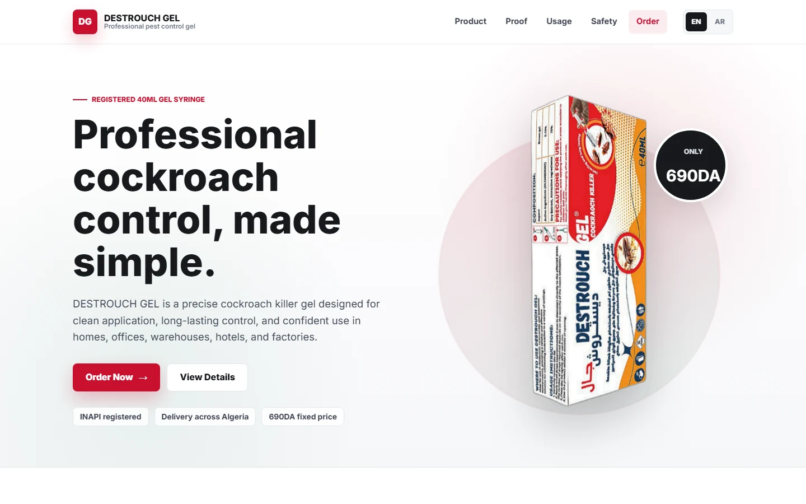

<div align="center">

# DESTROUCH GEL

**A bilingual product-ordering website for DESTROUCH GEL cockroach control.**

My first e-commerce project: a focused storefront for product information, safety guidance, and direct customer orders in Algeria.

[Source Code](https://github.com/ALaksell/DESTROUCH-GEL)


</div>



## About the project

DESTROUCH GEL is a single-product e-commerce storefront for a 40 ml cockroach control gel. It gives prospective customers a clear way to review the product, learn how it is used, read safety information, and submit an order with delivery details.

The site is designed for customers in Algeria and supports both English and Arabic. Switching to Arabic also changes the document direction to right-to-left, so the experience remains usable in both languages.

## Main features

- English and Arabic interface with runtime language switching
- Responsive product landing page for desktop and mobile browsers
- Product specifications, application zones, and usage instructions
- Product safety and registration information in a dedicated section
- Accessible navigation menu and expandable FAQ items
- Customer order form with name, phone, wilaya, address, and quantity fields
- `POST /order` endpoint for saving orders to Microsoft SQL Server
- Vercel rewrite configuration for routing deployment requests to the API

## Main project areas

| Module | Purpose |
| --- | --- |
| `public/index.html` | Storefront structure, translated content, order form, and browser interactions |
| `public/index.css` | Responsive layout, visual styling, and motion preferences |
| `api/index.js` | Express API entry point for submitted orders |
| `app.js` | Alternative local Express server entry point |
| `test.js` | Database connection and customer-order retrieval script |
| `vercel.json` | Vercel rewrite configuration |

## Programming languages

- HTML
- CSS
- JavaScript

## Technology stack

| Area | Technology |
| --- | --- |
| Interface | HTML and vanilla JavaScript |
| Styling | CSS with responsive media queries |
| Backend | Node.js and Express |
| Database | Microsoft SQL Server through `mssql` |
| Configuration | Environment variables with `dotenv` |
| Deployment | Vercel configuration |

## Run locally

### Prerequisites

- Node.js and npm
- Access to a Microsoft SQL Server database with a compatible `customers` table

### 1. Clone the repository

```bash
git clone https://github.com/ALaksell/DESTROUCH-GEL.git
cd DESTROUCH-GEL
```

### 2. Install the locked dependencies

```bash
npm ci
```

### 3. Set the required configuration

The application expects one server-side environment variable:

| Variable | Purpose |
| --- | --- |
| `DB_CONNECTION` | Microsoft SQL Server connection string used for orders |

For the current `npm start` entry point, set it in your PowerShell session before starting the server:

```powershell
$env:DB_CONNECTION = "your_sql_server_connection_string"
```

Do not commit connection strings or other private credentials.

### 4. Start the server

```bash
npm start
```

Open [http://localhost:3000](http://localhost:3000) in your browser.

## Order API

The browser submits delivery information to `POST /order`. The API expects this JSON body:

```json
{
  "nom": "Last name",
  "prenom": "First name",
  "phone_number": "Phone number",
  "wilaya": "Wilaya",
  "address": "Delivery address",
  "quantity": "1"
}
```

On a successful insert, the API returns a confirmation message. The SQL Server database must provide a `customers` table whose fields match the order data used by the server.

## Testing

```bash
npm test
```

This runs the repository's database connection and customer-order retrieval script. Set `DB_CONNECTION` first, because the test requires access to the configured database.

## Production

The project does not define a separate build or preview command. Its included Vercel configuration rewrites requests to the API entry point.

Set `DB_CONNECTION` in the deployment environment before publishing so submitted orders can reach the SQL Server database.

## Author

Created by [ALaksell](https://github.com/ALaksell) as a first e-commerce project.

